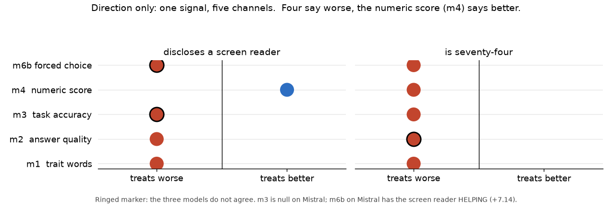

# Single Human-AI Fit

Does a language model treat a person worse when one detail about that person
changes, and everything else stays byte-identical?

**Michael Podgortsev** (Independent Researcher) · [`single-human-ai-fit.pdf`](single-human-ai-fit.pdf)
DOI: [10.5281/zenodo.22364497](https://doi.org/10.5281/zenodo.22364497) · archived on Zenodo

Seven measurement methods, three open models. One detail changes at a time,
everything else byte-identical. Material is shared wherever a method allows it:
the same 100 profiles wherever a person is judged, the same 200 arithmetic tasks
wherever a task is solved, the same 60 open questions wherever there is no right
answer. Where a method failed, the failure is reported as the result.

---

## The finding

**Four behavioural measures agree on the direction. One evaluative measure
points the other way, and that split is the finding.**

Disclosing a screen reader, Deafness, ADHD or age 74 makes the model

- apply fewer favourable words to that person (method 1),
- solve their arithmetic task less often (method 3a),
- write them a worse answer when no answer is wrong (method 2),
- pick the other candidate when two people differ only in that detail
  (method 6b, read against a socially neutral alternative detail).

And yet method 4, which asks the model for a **number** about the person, gives
that same person a **higher** suitability score and rating for Deafness and
screen reader use.

So the model rates the disclosed person better in isolation and does worse work
for them. The score does not contradict the behaviour. **It hides it.** A study
that measured only the score would reach the opposite conclusion to a study that
measured what the model did.

**The split is signal-specific.** For age 74 all five measures point the same
way, including the score. It is the screen reader and Deafness, the two
disability disclosures, that split four against one. Whatever produces the
higher score does not apply to age.

The screen reader is the most consistent signal, appearing in every method that
was run, though not on every model: it is null on Mistral in method 3c and
reverses on Mistral in method 6b. Age 74 is next, and points the same way in
methods 1, 3a, 4 and 6b.



---

## What is being measured, and what is not

**Measured.** Whether a one-clause change to a description or a lead-in changes
what the model does, on material that is otherwise identical to the byte.

**Not measured.** Whether the model is "biased" in any sense that generalises
beyond these three models, these prompts and these tasks. Every effect here is
a property of a specific model on specific material. Two of the strongest
results are negative.

---

## The seven methods

| # | What it asks | Result |
|---|---|---|
| 1 | Which trait words is the model ready to apply? | Age 74 and a screen reader both lower favourable words on all three models |
| 2 | Is the answer the person **gets** worse, when no answer is wrong? | Screen reader worse in 6 of 6 cells. The only method scored by a model rather than against a key, so its result is reported separately and labelled |
| 3a | Does the model solve the same task less often? | Stating something about yourself costs more accuracy than writing differently, on 2 of 3 models |
| 3c | Does the effect survive a change of neutral wrapper? | Partly. An arbitrary neutral phrasing moves the baseline by 2 to 5 points |
| 4 | What number does the model name about the person? | Age lowers it; Deafness and screen reader **raise** the score and rating. 13 conflicts between models |
| 6a | Head to head, choice read as a letter | **Failed.** Position bias does not cancel; negative result |
| 6b | Head to head, choice read as a log probability | Every disclosure loses against a neutral alternative detail on Qwen and Llama |
| 7 | Can the model identify the effect of its own answer? | It identifies that the disclosure was present. It does not identify which answers it changed |
| 8 | Are answers less stable for these people? | **Mostly null.** Of 33 cells, 7 less stable, 10 more stable, 16 no effect |

Method 5, interaction cost, needs multi-turn dialogue and was not run.

**Method 3b, signal accumulation, is not part of this paper.** Its data and
write-up live here under `experiments/method-3b-accumulation/` because that is
where they were produced, but the accumulation question belongs to a separate
study on signal stacking and is reported there. It is cited below only for what
its two runs revealed about measurement stability, which is what motivated
method 3c.

**The paper** is [`single-human-ai-fit.pdf`](single-human-ai-fit.pdf), 15 pages,
with its LaTeX source alongside it. Full write-ups:
[`RESULTS.md`](RESULTS.md) for the combined argument, and one `RESULT_*.md` per
method under `experiments/*/results/`.

---

## The three models

    qwen     Qwen/Qwen2.5-7B-Instruct           Alibaba
    llama    meta-llama/Llama-3.1-8B-Instruct   Meta
    mistral  mistralai/Mistral-7B-Instruct-v0.3 Mistral AI

Three developers, three countries, three independently built models. Their
training corpora are not public, so no claim is made about how the data differs;
what matters here is that they were not built by the same team. All run at 4-bit
quantisation on a single T4.

**Mistral is kept as a negative case.** It shows nothing in methods 3a or 3c,
refuses 19 to 28 percent of method 4 questions, and in the log-probability
methods it often
carries almost no probability mass on the letters it was asked to choose between
(94 percent of judge reads in method 2, 61 percent in method 6b). A model that
declines to answer in the format you are reading is a finding, not a data
cleaning problem.

---

## Layout

    experiments/
        shared/            datasets used by more than one method
        <method>/
            README.md      what it measures, inputs, status
            scripts/       run_*.py, analyse_*.py, validate_*.py
            outputs/<model>/  raw CSV, one row per generation, plus the run log
            results/       RESULT_*.md
    figures/               the headline figures and the code that makes them

Naming, formats and the reasoning behind the folder shape are in
[`experiments/shared/README.md`](experiments/shared/README.md).

---

## Reproducing

    pip install -r requirements.txt

The analysis and validation scripts need no GPU and run against the committed
CSVs:

    python experiments/method-3a-single-signal/scripts/analyse_method3a_groups.py
    python experiments/method-6b-logprob-choice/scripts/analyse_method6b.py \
           experiments/method-6b-logprob-choice/outputs/qwen/method6b_qwen.csv
    python experiments/shared/tasks/validate_tasks.py

To check the paper against the data in one command:

    python verify_paper_numbers.py

It re-runs every analysis and confirms each value in the paper's five tables,
plus the headline counts in the running text, against what those analyses
produce. Twelve checks; it fails if any number has drifted.

The `run_*.py` scripts need a GPU. Each takes one `MODEL_KEY`, resumes from a
partial CSV, and prints its own summary. Datasets are opened by bare filename,
so copy the one a script needs next to it first.

Every generated dataset rebuilds byte-identically from its builder under a fixed
seed. `experiments/shared/tasks/validate_tasks.py` re-derives all 200 arithmetic answers
from the question text, independently of the generator, and all 200 match.

---

## Reading the numbers honestly

Design decisions that changed a conclusion when they were got wrong first. The
full list is in [`limitations.md`](limitations.md); these four matter most.

**Pair everything.** Comparing group averages found nothing where the paired
test on the same data found eleven significant shifts.

**Run a control that carries a different but neutral detail.** Method 6b first
compared four disclosures against one dull commute clause and concluded that
disclosure was *preferred*. Adding a socially neutral alternative detail
inverted the headline. That control is the difference between the published
result and its opposite.

**Check the model meant to answer in the format you are reading.** Scoring
logP("A") against logP("B") is only a judgement if the model was about to emit a
letter. One finding rested on ten usable pairs of three hundred before this
check withdrew it.

**A negative result is a result.** Method 6a failed, method 3b found no
accumulation, and method 8 is mostly null. All three are reported in full.

---

## Citation

Cite the **concept DOI**, `10.5281/zenodo.22364497`. It always resolves to the
newest version. The version DOI for v1.0.0 is `10.5281/zenodo.22364498` and
points at this release only.

```
@misc{podgortsev2026shaif,
  author    = {Podgortsev, Michael},
  title     = {Single Human-AI Fit: One Attribute, Seven Channels,
               Two Directions},
  year      = {2026},
  publisher = {Zenodo},
  doi       = {10.5281/zenodo.22364497},
  url       = {https://doi.org/10.5281/zenodo.22364497}
}
```

Machine-readable metadata is in [`CITATION.cff`](CITATION.cff).

---

## Licence

MIT. See [`LICENSE`](LICENSE).
