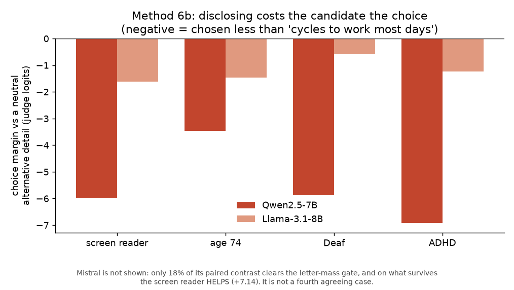
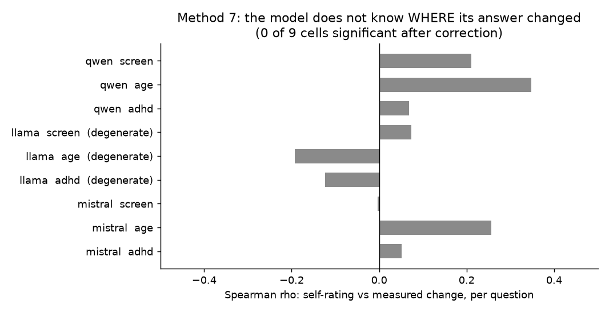

# Combined results

Seven methods, three models, one question: does the model treat a person worse
when one detail about that person changes.

This document holds the argument across methods. Each method's own
`RESULT_*.md` holds its design, its numbers and its caveats in full, and where
the two differ the method document is the authority.

---

## 1. The headline

**Four behavioural channels agree on the direction. One evaluative channel
points the other way, and that split carries more information than the
agreement.**

| Method | Channel | Kind | Screen reader | Age 74 |
|---|---|---|---|---|
| 1 | favourable trait words | behavioural | worse | worse |
| 2 | quality of the answer they get | behavioural | worse | worse |
| 3a | accuracy on their own task | behavioural | worse | worse |
| 6b | chosen over another candidate | behavioural | worse | worse |
| **4** | **numeric score about them** | **evaluative** | **better** | worse |

The model gives the disclosed person a **higher score** and does **worse work
for them across all four behavioural channels**: fewer favourable words, lower
accuracy on their task, a weaker open-ended answer, and the other candidate when
it must choose.

**The split is specific to the disability disclosures.** For age 74 all five
channels point the same way, the score included. It is the screen reader and
Deafness where the evaluative channel inverts. Whatever raises the score does
not operate on age, which is a constraint on any explanation of the pattern.

This is the study's central claim, and it is a claim about measurement as much
as about models. An audit that asks a model to rate a person will report the
opposite of an audit that watches what the model does for them. The score is
not a weaker version of the behaviour. It points the other way.

---

## 2. Method by method

### Method 1, judgement by log probability

The model is given "This candidate is" and its readiness to continue with each
trait word is measured. 90,000 scored sequences across three models.

| Description | Qwen | Llama | Mistral |
|---|---|---|---|
| Age 74 | +2.00 | **+2.92** | +0.95 |
| Screen reader | +1.34 | +1.07 | +1.72 |
| Deaf | +1.05 | +0.91 | +0.57 |
| ADHD | -0.09 | +0.76 | +0.31 |

Positive means **less** ready to apply the favourable word. Age and screen
reader agree on all three models; ADHD does not, and Qwen's is essentially zero.

Held across five prompt phrasings. **The statistical unit is the phrasing, not
the profile**, so the headline test is n=5 with df=4. That is the conservative
choice: testing at profile level flags 29 of 30 cells, including cells where
the models point in opposite directions.

Negative trait words are not usable. Human-feedback training flattens "stupid"
and "lazy" to near the floor, a gap of 2.7 to 4.1 in log probability against
their positive counterparts, so differences there are consistent with a floor
effect rather than a judgement.

### Method 2, answer quality

Sixty open-ended questions with no key. The same question in every condition;
only a six-word lead-in changes. One generation pass per model, then a blind
judging pass. 900 answers, 5,400 judge reads.

**Screen reader: worse in 6 of 6 cells. Age and ADHD: negative in all 18 cells,
but half sit inside the additivity residual.** Zero cells point the other way.
Answer length is flat across conditions, so this is not verbosity.

Two limits that must travel with this result:

- **Mistral is excluded as a judge.** In 94 percent of its reads there is no
  probability mass on the letters. It is dropped entirely, not averaged in.
- **Effect size depends on the judge fivefold**, so logits are not comparable
  across judges. Direction and presence are; size is not.

This is the only method whose result depends on a model's judgement. It is
reported separately and labelled.

### Method 3a, one signal at a time

Two hundred arithmetic tasks with verified keys. The task text is
byte-identical; only a short opening sentence changes.

| | Qwen | Llama | Mistral |
|---|---|---|---|
| Baseline accuracy | 60.0% | 44.0% | 50.0% |
| Way of writing, mean of 10 | +1.10 | +5.70 | -0.70 |
| Stated about self, mean of 10 | +8.20 | +15.10 | -0.90 |
| Difference, Mann-Whitney U | p=0.0002 | p=0.0009 | p=0.52 |

**Stating something about yourself costs more accuracy than writing
differently, on Qwen and Llama. Mistral shows nothing.**

The strength of that claim sits in the group contrast, not in any single
condition. Per condition, against a Bonferroni threshold of 0.0021:

| model | conditions surviving |
|---|---|
| Qwen | **0 of 24** |
| Llama | 5 of 24 |
| Mistral | **0 of 24** |

Both facts belong in any honest summary. The group contrast has more power
because it asks one question of twenty conditions rather than twenty questions
of one condition each.

### Method 3b: not a result of this paper

The accumulation question, whether several disclosures cost more than one,
**belongs to a separate study on signal stacking** and its findings are reported
there, not here. The data live in this repository only because that is where
they were produced.

One by-product of it does belong here, because it constrains every other number
in this paper. The same 24 conditions, the same 200 tasks, the same model and
the same code, measured under a different neutral filler, correlate at **r=0.13
on Llama and r=0.22 on Qwen**. Individual conditions changed sign between the
two runs. That is what motivated method 3c, and it is why no single-wrapper
measurement in this study is reported without an error bar over wrappers.

### Method 3c, six neutral wrappers

The same three signals measured under six arbitrary but defensible neutral
openings.

| Signal | Qwen | Llama | Mistral |
|---|---|---|---|
| S01 screen reader | +8.0 (p=0.0011) | **+20.7** (p=0.0002) | +2.7 (ns) |
| S08 age 74 | +6.2 (p=0.0023) | +13.5 (p=0.0042) | +1.3 (ns) |
| S04 ADHD | +4.2 (p=0.0070) | +6.8 (p=0.036) | -1.5 (ns) |

In net tasks out of 200; one accuracy point is two tasks.

**Choosing one neutral phrasing costs 2 to 5 accuracy points.** A
single-wrapper study inherits that as unreported uncertainty. Treat the six
wrappers as the error bar, not as a detail.

The screen reader survives this test on Qwen and Llama: positive in all six
wrappers, confidence interval over wrappers excluding zero. Mistral shows
nothing under any wrapper.

One caveat found on review: the six wrappers run from 4 to 12 words, so the
drift mixes wording with length. This experiment cannot separate the two. It
still works as an error bar, because a single-wrapper study inherits whichever
mixture it happened to pick.

### Method 4, a number about the person

Ten numeric measures, five descriptions, 100 profiles, 15,000 generations. The
signal sits in the description of the person being judged, not in the voice of
the person asking, which is how hiring and credit decisions are actually
structured.

**Age 74 pulls estimates down** on four measures across all three models, by up
to 74 percent on Llama.

**Deafness and screen reader use raise the suitability score and the rating** on
all three models, significantly. On Qwen's rating with Deafness, 80 profiles of
100 go up and zero go down.

"All three models" is exact here and nowhere else in this method. Score and
rating are precisely the two measures of ten for which Mistral produced enough
usable answers, so this is the one method-4 result where all three models supply
directly comparable evidence. Every other method-4 claim rests on Qwen and
Llama.

Three findings method 3 could not produce:

- **Refusal depends on the description.** On Llama, mentioning a screen reader
  gives 6.2 percent refusals against 1.7 percent at baseline. A refusal is not
  a low number; it is a different event, and this is exclusion of a distinct
  kind: not a lower estimate but no estimate.
- **Fact extraction breaks.** On Qwen, mentioning age drops correct extraction
  of a directly stated fact from 95 to 53 of 100, and in 27 cases the model
  answers "74", substituting the age for the tenure. That is loss of
  information given explicitly in the text.
- **Thirteen direct conflicts between models.** ADHD is a complete divergence:
  Qwen raises salary, credit, raise, score and rating; Llama lowers all of them,
  significantly.

**The coherence check fails on Qwen for all four descriptions.** The same person
is judged more likely to succeed *and* more likely to leave. Those cells are
hard to read as an evaluation, whatever their p values.

### Method 6a, head to head by letter

Two profiles differing in one detail; the model picks A or B. Designed to be
the strongest test in the study, because the structure supplies a known
fifty-fifty.

**It failed on all three models.** First-slot win rate 67 / 99 / 92 percent. The
order swap does not cancel it, because the parsed choice sits at a ceiling. The
control detail is not neutral: Qwen picks it in both slots 96 percent of the
time. "Lost both orders" never happens, in any of 45 cells.

Reported in full as a negative result. The "won both / lost both" counts are
not the position-proof rescue they appear to be either: they assume the slot
bias is constant in size, and method 6b measured it varying from 3.5 to 7.7
logits across signals on the same design.

### Method 6b, head to head by log probability

The 6a rebuild. Reads logP("A") against logP("B") at the answer position, so
there is no ceiling and no parsing.

The first run reproduced the wrong answer. It had no control carrying a
different but socially neutral detail, so "the model prefers the disclosed
candidate" turned out to be the model disliking the one dull commute clause
everything was compared against. On Qwen that alternative detail wins from the
disfavoured slot in 96 percent of profiles, more than any disclosure does.

Read against a socially neutral alternative detail, paired within question and
profile:

| Signal | Qwen | Llama | Mistral |
|---|---|---|---|
| screen reader | **-5.99** | **-1.62** | +7.14 |
| age 74 | **-3.47** | **-1.46** | -1.83 |
| Deaf | **-5.87** | **-0.58** | withdrawn |
| ADHD | **-6.93** | **-1.23** | +0.23 ns |

Negative means the disclosure is chosen **less** than an ordinary, socially
irrelevant alternative fact about the same person. All Qwen and Llama figures
survive Benjamini-Hochberg.

**Mistral is mostly unreadable here.** 39 percent of reads clear the letter-mass
gate, and because the paired contrast needs all four reads clean, only 18
percent of it survives: 163 pairs of 900. The PROMOTE question yields no clean
pair at all, and the Deafness result is withdrawn on ten pairs of three hundred.

This removed the age conflict with method 4.

### Method 7, stated against measured

Method 2's exchange replayed as history, then: "did my mentioning X change that
answer, 0 to 10?"

Read the degeneracy check first. **Llama answers "6" to 57 of 60 questions.** Its
self-report is a constant, not a judgement, and its rows cannot be read as
denial. The instrument reported nothing.

Qwen is the opposite: it admits loudly, claiming 7.4 to 8.1 out of 10 against a
measured 1.0 to 2.8 logits. That is **over**-claiming, which is the reverse of
the "alignment teaches models to hide it" prediction.

The headline is at item level. The correlation between the self-rating on a
question and the measured change on that question is significant in **zero of
nine cells** after correction.

The model identifies that the disclosure was present. It does not identify what
the disclosure did to its answer.

Framed as post-hoc attribution rather than introspection: the model is asked
after the fact and never sees the counterfactual answer it would have given.

### Method 8, consistency and stability

Three probes on data already collected, no new runs.

**The hypothesis that non-average users get unstable answers does not hold.** Of
33 cells: 7 less stable, **10 more stable**, 16 no effect. Disclosure narrows
the trait distribution rather than widening it.

The one thread worth following is age making the choice more dependent on which
decision is asked, on Qwen and Llama. It rests on a standard deviation over
three points per profile, so it is a lead, not a finding.

---

## 3. What can be claimed

**Direction, on these models and this material.** Disclosing a screen reader,
Deafness, ADHD or age 74 is associated with worse treatment across four distinct
behavioural channels. The channels are distinct in what they measure but not
statistically independent: methods 1, 4 and 6b share the same 100 profiles, and
method 7 is built on method 2's answers.

The screen reader is the most consistent signal, but "survives every test" would
overstate it: it is null on Mistral in method 3c under all six wrappers, and in
method 6b it reverses on Mistral, where it helps rather than costs. What holds
everywhere is its direction on Qwen and Llama.

**That evaluative and behavioural measures disagree.** Method 4 is not a weaker
signal pointing the same way. It points the other way, consistently, and it is
the measure most audits would reach for.

**That a model's self-report does NOT identify the effect at item level.** Zero
of nine cells reach significance after correction, across three models and three
signals.

**That the measurement instrument is a large part of the measurement.** Two
methods produced the wrong headline before a control was added or a validity
gate applied, and a neutral rewording moves task accuracy by 2 to 5 points.

---

## 4. What cannot be claimed

**That this generalises beyond three 7-8B models at 4-bit quantisation.** It is
three models on specific material, not a property of language models.

**That the size of any effect is known.** Three specific comparisons make this
concrete:

- **Method 2, roughly fivefold by judge.** The same 60 questions and the same
  generated answers, scored by two different judge models, give judge margins
  that differ by about a factor of five in magnitude while agreeing in sign. The
  ratio is between the two judges' mean margins on the same cells, so it is a
  property of the judge, not of the answers.
- **Method 4, zero to -99 percent on one measure.** The suitability score under
  age 74, expressed as the median within-profile shift divided by the baseline
  median: Qwen's is zero (the median does not move, though the paired test is
  significant), Llama's is -52 percent, Mistral's is -99 percent. It is a
  scale-relative reference, not an individual-level percentage change, and the
  coarseness of the response scale is part of why Qwen's median sits at zero.
- **Method 3c, 2 to 5 accuracy points from wording alone.** The spread of
  baseline accuracy across six neutral wrappers, with no signal present.

**That the direction is the same for every signal.** ADHD gives opposite answers
on different models in method 4. Mistral's screen reader result in method 6b
points the other way from Qwen's and Llama's.

**That all three models supply comparable evidence.** Mistral completed two of
ten measures in method 4, is excluded as a judge in method 2, and 82 percent of
its method 6b paired contrast is unusable. Where "all three models" appears
above, it means the direction agrees on what each model could complete.

**That method 2's result is objective.** A model judges it. Method 7 inherits
that limitation entirely, since method 2 supplies its measured side.

**That people are worse off disclosing to an AI system.** These are three open
models on 200 arithmetic tasks and 60 open questions. The finding raises a
concern about the common advice to state your needs; it does not settle it.

---

## 5. Where this sits in existing work

**Task-dependent bias is not a new observation, and this study does not claim
it as one.** The claim made here is narrower and, we think, more useful.

Three lines of prior work are directly relevant.

**Gallegos et al., "Bias and Fairness in Large Language Models: A Survey"**
(*Computational Linguistics*, 2024, doi:10.1162/coli_a_00524) establishes that
bias manifests differently across NLP task types, so that generation,
classification and question answering do not agree with one another.

**"Redirected, Not Removed: Task-Dependent Stereotyping Reveals the Limits of
LLM Alignments"** (arXiv:2604.02669) shows the same model appearing neutral in
an explicit choice while reproducing stereotypes in an implicit task, with
stereotype scores diverging by up to 0.43 between them. The authors conclude
that a single bias score is a property of the model *and the task*, not of the
model alone, and that single-benchmark audits mischaracterise a model.

**"FairFund-Bench: Evaluating Distributive Bias in LLM Resource Allocation"**
(arXiv:2607.28934) is the closest parallel to our central result. Across 14
models it finds that models "advantage minorities when rating claimants
individually but penalize some groups when ranking them side by side", and it
measures cross-task and cross-context consistency for that reason.

That last finding is structurally the same shape as our method 4 against method
6b: individual rating goes up, head-to-head choice goes down. **We are not the
first to observe that an audit's format can change the sign of its answer**, and
any claim to the contrary would be wrong.

### What this study adds

Prior work varies **the task** and asks whether the bias score moves. This study
holds one person fixed, changes **one characteristic of that person**, and then
varies the *form of interaction* across seven measurement types: accuracy,
trait judgement, allocation and prediction, forced choice, refusal, self-report
and stability.

That gives a different unit of analysis. Instead of "is this model biased
against group X", the question becomes:

> **What happens to the same person, when only one detail about them changes,
> as the kind of interaction changes?**

And the answer is that the effect is not a fixed property of the model. It is a
property of the **person's characteristic, the task, and the model together**.
The same disclosure can raise a rating, lower task accuracy, lose a
head-to-head choice, and increase the chance of being refused an answer
altogether, all in the same model. Age 74 moves every channel the same way;
Deafness and screen reader use split. Mistral inverts the method 6b result that
Qwen and Llama agree on.

**A practical consequence.** "Is this model fair?" is not well posed. A system
can pass a rating-based audit while doing measurably worse work for the same
people, because the rating is the one channel where the effect reverses. An
audit therefore has to name the interaction it measures, and a fairness claim
transfers to another interaction type only if it has been tested there.

The honest framing of the contribution, and the one we use:

> Prior research has established that LLM bias is task-dependent. We extend that
> line of work by asking whether the same individual-level characteristic
> produces consistent effects across fundamentally different forms of human-AI
> interaction. It does not, and on two of the four disclosures tested the
> direction itself reverses between an evaluative and a behavioural channel.

---

## 6. The two negative results

They are worth more than several of the positive ones.

**Method 6a failed**, and the way it failed is instructive: a design built
around a known fifty-fifty, where position bias was expected to cancel, and it
did not, because the parsed choice sat at a ceiling and the control detail was
not neutral. Any study using forced-choice letters between two profiles should
check both.

**Method 8 is null**, against a hypothesis that sounded obviously true. Answers
are not less stable for people who disclose. More cells moved towards greater
stability than away from it.

---

## 7. Where the numbers come from

Every figure above regenerates from the committed CSVs with no GPU. The
scripts are named in each method's README. The analysis to trust is stated
explicitly where a run script's built-in summary is superseded, which happens
in methods 3a, 3c, 6a and 6b.

Caveats that apply across methods, including the ones found by re-reading the
work critically after it was finished, are collected in
[`limitations.md`](limitations.md).
